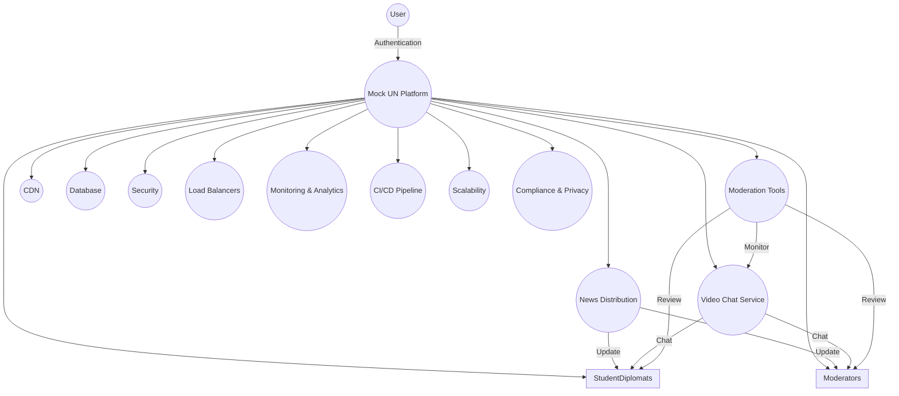
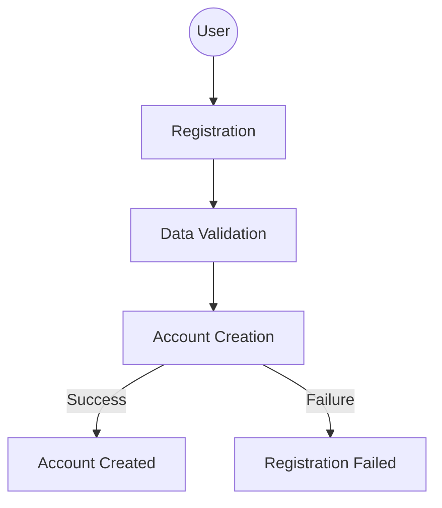
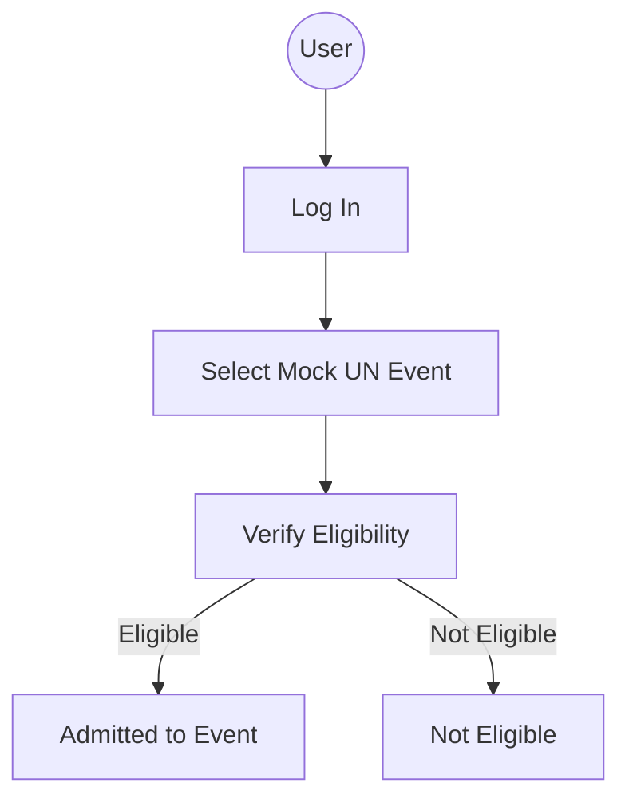
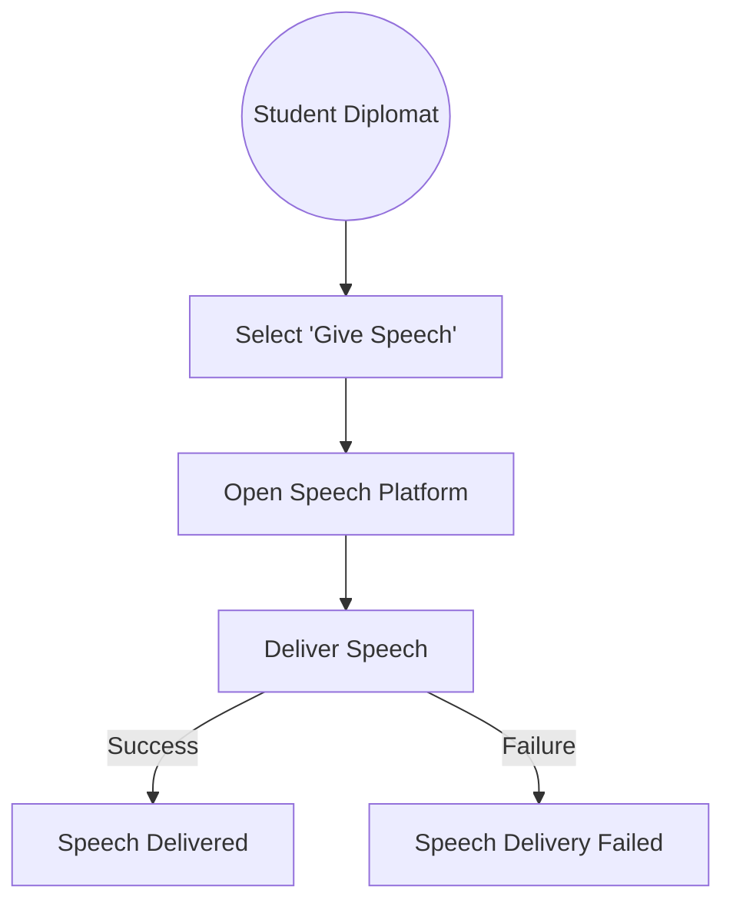
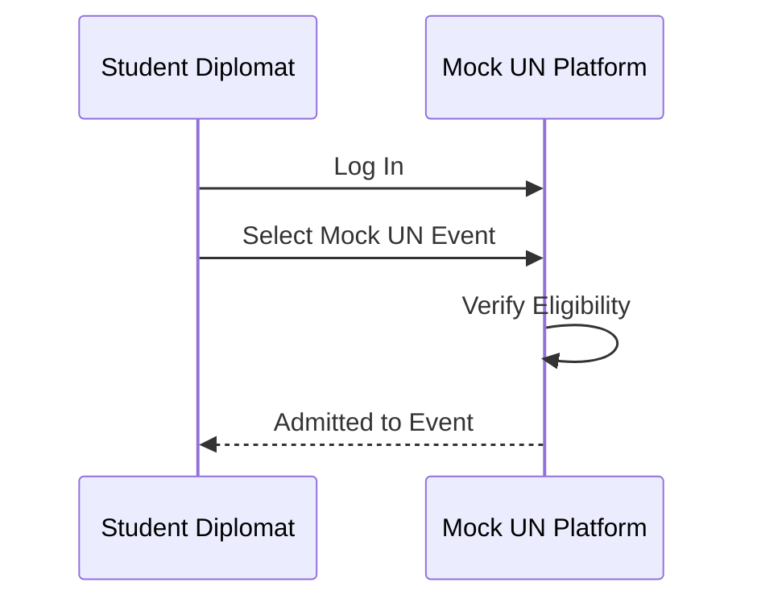
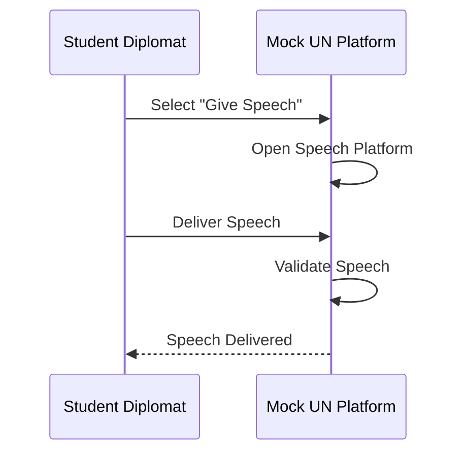
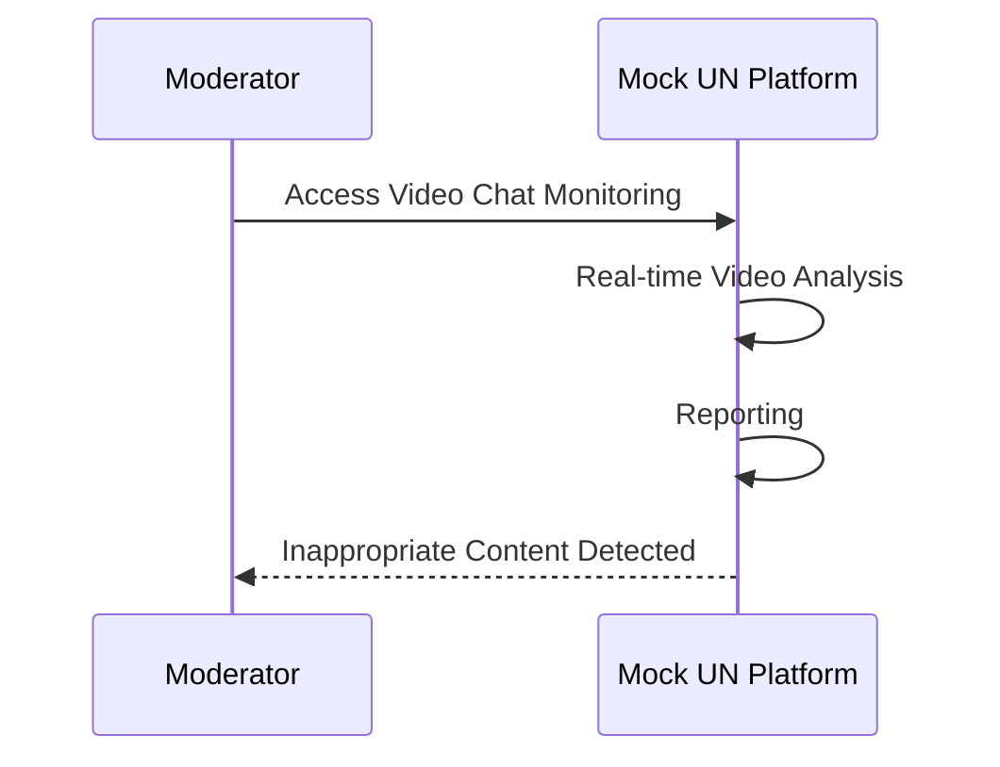
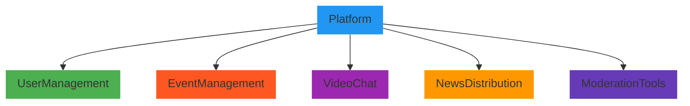
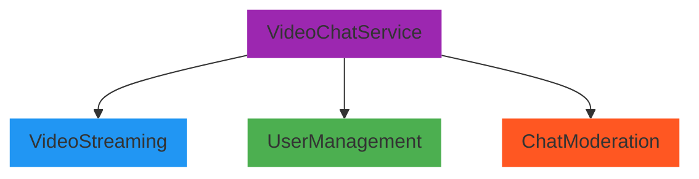
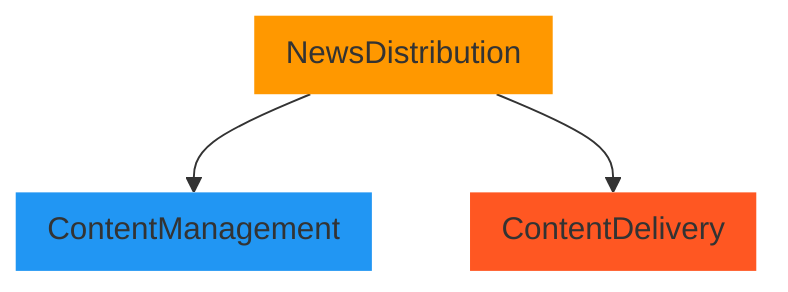

# Mock Internet UN

Organization running "Mock UN" events wants to take its events online, permitting students to participate online

Requirements: student-diplomats must be able to video-chat with one another; student-diplomats must be able to "give speeches" to the "assembly" (video-chat to the entire group); (mocked) world events (created by moderators) distributed via (mock) "news sites"; moderators must be able to monitor any video chat for appropriateness

Users: 500 or so "diplomats" per "mock UN" gathering; dozens of moderators per "mock UN"; many "mock UN"s simultaneously; no new hardware requirements on students

See [here](https://www.architecturalkatas.com/kata.html?kata=MockInternetUN.json)

## System Architecture Diagram

This high-level diagram provides an overview of the entire system, showing major components and their interactions. It's an excellent starting point for understanding the system at a glance.

## Use Case Diagrams

Use case diagrams depict the interactions between different actors (e.g., student-diplomats, moderators) and the system. It helps in visualizing how users interact with the platform.

### Use Case 1: User Registration

- **Actor**: User (Student Diplomat or Moderator)
- **Description**: Users can register for an account on the platform.
- **Flow**:
    1. User enters registration information.
    1. The system validates and stores user data.
    1. User account is created.

### Use Case 2: Join Mock UN Event

- **Actor**: User (Student Diplomat or Moderator)
- **Description**: Users can join a Mock UN event.
- **Flow**:
    1. User logs in to the platform.
    1. User selects a specific Mock UN event.
    1. The system verifies the user's eligibility.
    1. User is admitted to the event.

### Use Case 3: Give Speech in Assembly

- **Actor**: Student Diplomat
- **Description**: Student diplomats can give speeches to the entire assembly.
- **Flow**:
    1. Student diplomat selects the "Give Speech" option.
    1. The system provides a platform for giving speeches.
    1. Student diplomat delivers a speech to the assembly.

## Sequence Diagrams

Sequence diagrams can illustrate the interactions and flow of messages between components, especially in scenarios like student-diplomats giving speeches or moderators monitoring video chats.

### Interaction 1: Student Diplomat Joins a Mock UN Event

### Interaction 2: Student Diplomat Gives a Speech in Assembly

### Interaction 3: Moderator Monitors Video Chat for Inappropriateness

## Component Diagram

Component diagrams break down the system into smaller, manageable components and show how they interact with each other. This is useful for understanding the modular structure of the platform.

### Platform Component Diagram

### Video Chat Service Component Diagram

### News Distribution Component Diagram

## Deployment Diagram

A deployment diagram visualizes the physical infrastructure and how software components are distributed across servers and other hardware. It can illustrate how the system is deployed to handle simultaneous events.

## Data Flow Diagram

Data flow diagrams can help in showing the flow of data and information through the system, such as how news articles are published, retrieved, and presented to users.

## Security Diagram

A security diagram can depict the various security measures in place, including encryption, access controls, and authentication mechanisms.

## Network Topology Diagram

Network topology diagrams show the layout of the network infrastructure, which can be important for understanding how video data is transmitted and received.

## Class Diagram

Class diagrams can be useful to describe the structure of classes and objects in the system, especially in the context of user authentication and authorization.

## Monitoring and Analytics Diagram

If you have a monitoring and analytics system, a diagram can illustrate how data is collected, processed, and visualized for system performance and user engagement insights.

## CI/CD Pipeline Diagram

A diagram can depict the continuous integration and continuous deployment pipeline, including stages, tools, and automation processes.

## Load Testing Diagram

Illustrate the load testing setup, including tools, scenarios, and results to demonstrate the system's readiness for handling concurrent users.

## Compliance and Privacy Diagram

If dealing with sensitive data, a diagram can show how the system complies with data protection and privacy regulations.
